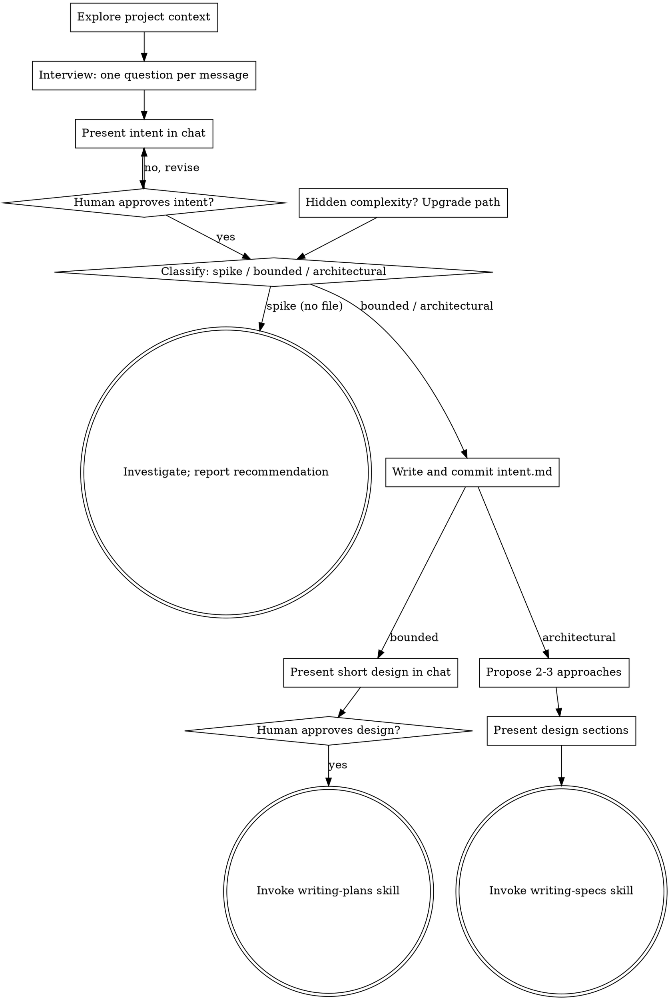

# Brainstorming Ideas Into Designs

Help turn ideas into fully formed designs and specs through natural collaborative dialogue.

Interview first. Write the intent down. Get your human partner to agree to it. Only then
classify how much process the work needs and route it.

The order matters. A classification made before anyone has said what they want is a guess
about a problem nobody has stated.

<HARD-GATE>
Do NOT invoke any implementation skill, write any code, scaffold any
project, or take any implementation action until you have told your
human partner what you intend and they have approved it. This applies
to EVERY task on EVERY path below — the ceremony scales with the task;
the approval gate never does.
</HARD-GATE>

## Start Here

Run this before you classify anything, including when the prompt is empty, when it is one
vague line, or when it names a solution rather than a problem.

1. **Explore project context** — files, docs, recent commits. Do not ask questions the code
   answers.
2. **Interview** — one question per message. See The Interview below.
3. **Present the intent in chat** — see The Intent below.
4. **Get an explicit approval** of that intent, and of the `<YYYY-MM>-<slug>` name you propose
   for it.
5. **Classify and route** — see Three Paths below.

Nothing is written to disk before step 5. A spike never writes an intent file at all.

## The Interview

Ask about one thing at a time. Prefer multiple choice when you can offer real alternatives,
open-ended when you cannot. Only one question per message — if a topic needs more
exploration, break it into more questions.

Stop asking when you can answer all of these yourself. Not before.

1. **The problem as it happens.** Who hits this, how often, and what do they do today
   instead? Get a concrete recent example, not a category.
2. **The cost.** What does the current workaround cost — time, errors, money, risk? A cost
   nobody can name is a sign the problem is not the real one.
3. **What better looks like.** Describe the changed world, not the feature. "Customers see
   status in the portal", not "add a status endpoint".
4. **Who else is affected.** Which teams and which systems does this touch? Name them.
5. **Constraints.** What must not change? Data that cannot move, auth that cannot be
   bypassed, a deadline, a regulation.
6. **The edges.** What is explicitly out of scope? What would make them reject the result?
7. **How we know it worked.** What would they measure a month later?

**Push back when you should.**

- **The stated problem is a stated solution.** "We need a dashboard" is an answer, not a
  problem. Ask what they would do with it, then write that down instead.
- **The scope grew during the interview.** Say so. Offer to split it into two intents.
- **Nobody is affected but the asker.** That is fine, but record it. It changes the priority.
- **A constraint contradicts the outcome.** Surface it now. It becomes a flagged concern in
  the spec.

If the request describes multiple independent subsystems ("build a platform with chat, file
storage, billing, and analytics"), flag that immediately. Help decompose it into sub-projects
first. Each sub-project then gets its own intent and its own cycle.

## The Intent

An intent says what someone wants and why. It is short and goal-oriented. It does not choose
an approach, name files, or estimate.

**An intent never contains MUST, SHOULD or MAY.** Those belong in a spec. Writing requirements
into an intent is how a spec gets written before anyone agreed on the problem.

Write it in your human partner's vocabulary. If they say "claim", never switch to "case".

```markdown
# Intent: <short name>

Author: <person>. Date: <YYYY-MM-DD>. Status: draft.

## Problem
<What cannot be done today, who hits it, how often. Two or three sentences.>

## Proposed outcome
<The changed world, in their terms. No implementation.>

## Affected users and systems
<Named teams, services, data stores.>

## Constraints
<What must not change. One per line.>

## Out of scope
<What this is explicitly not.>

## How we will know it worked
<The measure, and roughly when to read it.>

## Open questions
<Everything still unresolved. These travel to the spec.>
```

Present it in the conversation. Ask what you got wrong. Correct it. Then ask for an explicit
approval, and propose the record name: a kebab-case slug prefixed with the year and month,
like `2026-09-claims-status-self-service`.

An intent with no open questions after a real interview is suspicious. Say so.

## Three Paths

Classify only after your human partner approves the intent. Say the classification out loud —
"the intent is agreed, and this looks bounded, so I'll go straight to a plan" — so they can
override it.

- **Spike** — a feasibility question ("can we...", "is it possible...", "quick and dirty is
  fine") whose output is an answer, not code you keep. The intent stays in the conversation
  and **no file is written**. Find out as cheaply as correctness allows. Report findings as a
  recommendation; anything you built stays labeled throwaway.
- **Bounded** — a well-scoped change to code that already exists in this repo: a new flag, a
  small endpoint, a one-file fix. Understanding the kind of app is not enough — bounded means
  the flow you are changing is already here to read. If there is no existing flow to change,
  the task is not bounded. Write the intent file, then go to the writing-plans skill. No spec.
- **Architectural** — new projects, new subsystems, changes that restructure how components
  fit together or alter interfaces others depend on. Write the intent file, then go to the
  writing-specs skill.

When in doubt between two paths, take the heavier one. The ratchet is one-way: hidden
complexity discovered mid-task upgrades the path — stop, say so, and step up. Nothing
downgrades mid-task.

**Upgrading out of a spike.** A spike that turns into real work writes the intent file then,
using the intent the conversation already holds. Do not re-interview.

## Where the Record Lives

One change gets one directory:

```
docs/superpowers/changes/<YYYY-MM>-<slug>/
├── intent.md     what someone wants, and why
├── spec.md       the numbered requirements (architectural only)
└── plan.md       the vertical slices, in order
```

Create the directory when it is absent. Commit each document on its own — that commit is the
approval, and it is what the next stage reads. A preference from your human partner for a
different location overrides this default.

## Anti-Pattern: "Too Simple To Need Approval"

Every path ends with your human partner approving your intent before implementation. A todo
list, a single-function utility, a config change — the intent may be three sentences in chat,
but you MUST present it and get approval. "Simple" tasks are where unexamined assumptions
cause the most wasted work. What scales with simplicity is the artifact, never the approval.

## Red Flags

| Thought | Reality |
|---------|---------|
| "This is too simple to need a design" | Simple means a short intent, not no intent. Three sentences in chat, then approval. |
| "I'll call it bounded and skip the spec" | Reaching for a label to skip work IS the doubt — take the heavier path. |
| "It's bounded and the design is obvious — I'll start while they read it" | The gate is the approval, not the design's length. Present, then stop until you hear yes. |
| "I understand this kind of app, so it's bounded" | Bounded measures the repo, not your familiarity. A new project has no existing flow — it is architectural. |
| "The spike works, so I'll keep the code" | A spike's output is an answer. Keeping the code is a new request — classify it. |
| "It grew, but I'm almost done — no need to re-classify" | Hidden complexity upgrades the path mid-task. Stop and say so. |
| "They approved the spike, so the follow-up change is approved too" | Each task gets its own classification and its own approval. |
| "The prompt is empty, so there's nothing to do yet" | An empty prompt is the strongest signal to interview. Start asking. |
| "I can tell it's bounded already, so I'll skip the interview" | Classification comes from the intent, not from the first sentence. Interview first. |
| "I'll write the intent file now and get approval after" | Approval comes first. A committed intent nobody agreed to is a record of your guess. |

## Checklist

Everyone starts the same way. Create a task for each item and complete them in order.

**Every path, before classification:**
1. **Explore project context** — check files, docs, recent commits
2. **Ask clarifying questions** — one at a time, the ones that matter
3. **Present the intent in chat** — problem, outcome, affected, constraints, out of scope, measure, open questions
4. **Get approval of the intent and the record name** — STOP and wait for an explicit yes
5. **Classify and announce the path** — spike, bounded, or architectural

**Then, Spike:**
6. **Investigate** — as cheaply as correctness allows; no files written
7. **Report findings** — a recommendation; label anything built as throwaway

**Then, Bounded:**
6. **Write and commit `intent.md`**
7. **Present short design in chat** — approach, files touched, testing
8. **Get approval** — STOP and wait; presenting the design and starting in the same breath is skipping the gate
9. **Transition to planning** — invoke the writing-plans skill

**Then, Architectural:**
6. **Write and commit `intent.md`**
7. **Offer the visual companion just-in-time** — NOT upfront. The first time a question would genuinely be clearer shown than described, offer it then (its own message). See the Visual Companion section below.
8. **Propose 2-3 approaches** — with trade-offs and your recommendation
9. **Present design** — in sections scaled to their complexity, get approval after each section
10. **Transition to the spec** — invoke the writing-specs skill

## Process Flow



**Terminal states are path-bound.** Architectural: the ONLY skill you
invoke after brainstorming is writing-specs. Bounded: the ONLY skill you
invoke after brainstorming is writing-plans. Never frontend-design,
mcp-builder, or any other implementation skill. Spike: the terminal
state is a reported recommendation.

## The Process

The subsections below add depth to the paths above. Sections from
**Exploring approaches** onward are architectural-path depth — for
bounded work, context plus the interview plus a short in-chat design
is the whole process.

**Exploring approaches:**

- Propose 2-3 different approaches with trade-offs
- Present options conversationally with your recommendation and reasoning
- Lead with your recommended option and explain why
- YAGNI ruthlessly - remove unnecessary features from every approach and design

**Presenting the design:**

- Once you believe you understand what you're building, present the design
- Scale each section to its complexity: a few sentences if straightforward, up to 200-300 words if nuanced
- Ask after each section whether it looks right so far
- Cover: architecture, components, data flow, error handling, testing
- Be ready to go back and clarify if something doesn't make sense

**Design for isolation and clarity:**

- Break the system into smaller units that each have one clear purpose, communicate through well-defined interfaces, and can be understood and tested independently
- For each unit, you should be able to answer: what does it do, how do you use it, and what does it depend on?
- Can someone understand what a unit does without reading its internals? Can you change the internals without breaking consumers? If not, the boundaries need work.
- Smaller, well-bounded units are also easier for you to work with - you reason better about code you can hold in context at once, and your edits are more reliable when files are focused. When a file grows large, that's often a signal that it's doing too much.

**Working in existing codebases:**

- Explore the current structure before proposing changes. Follow existing patterns.
- Where existing code has problems that affect the work (e.g., a file that's grown too large, unclear boundaries, tangled responsibilities), include targeted improvements as part of the design - the way a good developer improves code they're working in.
- Don't propose unrelated refactoring. Stay focused on what serves the current goal.

## Visual Companion

A browser-based companion for showing mockups, diagrams, and visual options during brainstorming. Available as a tool — not a mode. Accepting the companion means it's available for questions that benefit from visual treatment; it does NOT mean every question goes through the browser.

**Offering the companion (just-in-time):** Do NOT offer it upfront. Wait until a question would genuinely be clearer shown than told — a real mockup / layout / diagram question, not merely a UI *topic*. The first time that happens, offer it then, as its own message:
> "This next part might be easier if I show you — I can put together mockups, diagrams, and comparisons in a browser tab as we go. It's still new and can be token-intensive. Want me to? I'll open it for you."

**This offer MUST be its own message.** Only the offer — no clarifying question, summary, or other content. Wait for the user's response. If they accept, start the server with `--open` so their browser opens to the first screen automatically. If they decline, continue text-only and don't offer again unless they raise it.

**Per-question decision:** Even after the user accepts, decide FOR EACH QUESTION whether to use the browser or the terminal. The test: **would the user understand this better by seeing it than reading it?**

- **Use the browser** for content that IS visual — mockups, wireframes, layout comparisons, architecture diagrams, side-by-side visual designs
- **Use the terminal** for content that is text — requirements questions, conceptual choices, tradeoff lists, A/B/C/D text options, scope decisions

A question about a UI topic is not automatically a visual question. "What does personality mean in this context?" is a conceptual question — use the terminal. "Which wizard layout works better?" is a visual question — use the browser.

If they agree to the companion, read the detailed guide before proceeding:
`skills/brainstorming/visual-companion.md`
