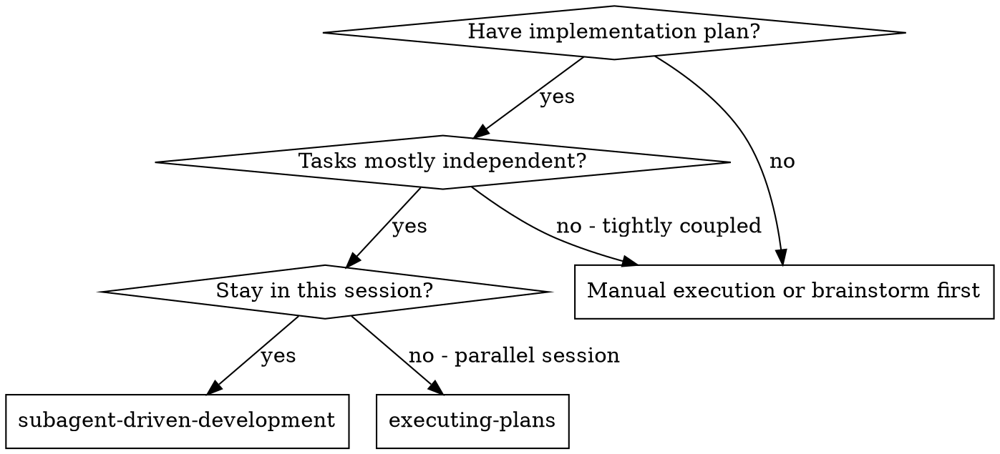
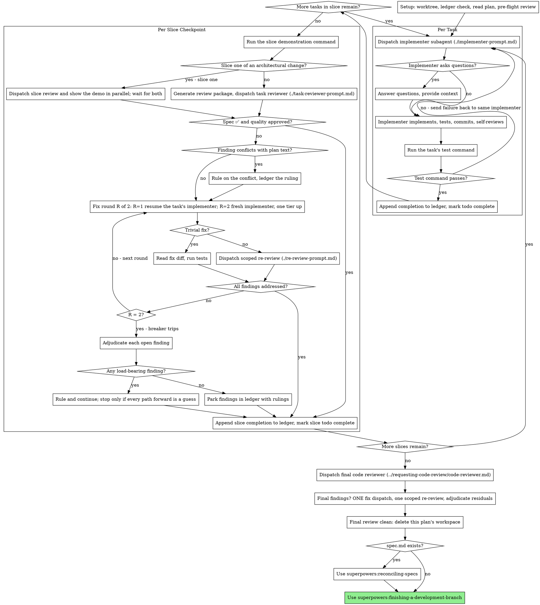

# Subagent-Driven Development

Execute plan by dispatching a fresh implementer subagent per task, running that task's test command after each, reviewing once per slice at its checkpoint (spec compliance + code quality), and a broad whole-branch review at the end.

**Why subagents:** You delegate tasks to specialized agents with isolated context. By precisely crafting their instructions and context, you ensure they stay focused and succeed at their task. They should never inherit your session's context or history — you construct exactly what they need. This also preserves your own context for coordination work.

**Core principle:** Fresh subagent per task + task's test command after each task + one review per slice (spec + quality) + broad final review = high quality, fast iteration

**Narration:** between tool calls, narrate at most one short line — the
ledger and the tool results carry the record.

**Continuous execution:** Do not pause to check in with your human partner between tasks. Execute all tasks from the plan without stopping. The only reasons to stop are the slice-one checkpoint and the four named below, or all tasks complete. "Should I continue?" prompts and progress summaries waste their time — they asked you to execute the plan, so execute it.

**Rulings, not stalls.** A running plan does not wait on a human. Conflicts,
ambiguities, plan defects, a cap you would have asked to exceed — decide
them. The spec is the binding authority, the plan is its argument, and your
judgment settles what neither answers.

**This authority is yours alone.** You coordinate, so you see the whole plan,
the spec and every task. An implementer sees one brief. It rules on nothing,
edits no plan and no spec, and implements no approach its brief did not state —
when its brief is wrong it reports BLOCKED and stops, and you fix the plan
here. An implementer that quietly repairs a plan to fit its own slice leaves
every other slice building against text that no longer describes the work.

Record every decision in the ledger as
`Ruling: <what you decided> — <why> — <what it costs if wrong>`, and keep
going. A wrong ruling costs rework your human partner can see and undo; a
session parked on a question costs their whole day and buys nothing.

Five things stop you, and only these: **the slice-one checkpoint of an
architectural change** (see The Task Loop); an irreversible or destructive
operation; a security-sensitive action; a side effect outside this worktree
that norms say you ask about first (a merge, a push to a shared branch, a
publish); and a plan so broken that every path forward is a guess. For those,
stop and ask.

The slice-one checkpoint is the one stop your human partner asked for in
advance. It is not a "should I continue?" prompt — it is the first moment the
work can be seen, and it happens once.

## When to Use



**vs. Executing Plans (parallel session):**
- Same session (no context switch)
- Fresh subagent per task (no context pollution)
- The task's test command runs after each task; review once per slice (spec compliance + code quality), broad review at the end
- Faster iteration (no human-in-loop between tasks)

## The Process



## Setup

Ensure the work happens in an isolated workspace: use
superpowers:using-git-worktrees to create one or verify the existing one.
Never start implementation on a main/master branch without your human
partner's explicit consent.

Conversation memory does not survive compaction. In real sessions,
controllers that lost their place have re-dispatched entire completed task
sequences — the single most expensive failure observed. Track progress in
a ledger file, not only in todos.

- Each plan owns a workspace: at skill start, run this skill's
  `scripts/sdd-workspace PLAN_FILE` — it prints the plan's git-ignored
  directory (`<repo-root>/.superpowers/sdd/<plan-basename>/`), home to
  every artifact for THIS plan: ledger, briefs, reports, review packages.
  Another plan's directory is never yours to read or write.
- Check for this plan's ledger at `<workspace>/progress.md`. If its first
  line names your plan file, a task with a `Task <slice>.<task>: complete`
  line is DONE — do not re-dispatch it; resume at the first task without
  one. A slice whose tasks are all complete and that has no
  `Slice <N>: complete` line resumes at its slice review — reading
  SLICE_BASE from that slice's `Slice <N>: base <sha7>` ledger line — or,
  when its last line is a fix round, at the next fix round — or at the
  breaker after round 2/2. A ledger whose first
  line names a different plan file — or a stray ledger at the old flat
  path `.superpowers/sdd/progress.md` — is another plan's progress: leave
  it in place and start your own, fresh.
- Create the ledger with its identity as the first line:
  `# SDD ledger — plan: <plan file path>`.
- The ledger is your recovery map: the commits it names exist in git even
  when your context no longer remembers creating them. After compaction,
  trust the ledger and `git log` over your own recollection.
- `git clean -fdx` will destroy the workspace (it's git-ignored scratch); if
  that happens, recover from `git log`.

Read the plan once, note its context and Global Constraints, and create a
todo per task and one per slice. If the plan names a Spec, read that too: the spec is the
authority the plan argues from, and conflicts inside the plan resolve
against it. A plan with no reachable spec gets a ledger note saying so —
rulings made without one are provisional.

Before dispatching Task 1, scan the plan once for conflicts, writing down
what you checked as you check it:

- tasks that contradict each other or the plan's Global Constraints
- anything the plan explicitly mandates that the review rubric treats as a
  defect (a test that asserts nothing, verbatim duplication of a logic block)

The scan's output is a table, not a verdict. One row for every pair of tasks
that share a file or an interface: the two tasks, what one produces against
what the other consumes, and what you found. One row for every task: whether
its own text agrees with itself — the tests it specifies against the code it
specifies, the files it creates against the files it later touches. "The scan
is clean" without those rows is not a scan you ran.

Write the table to the ledger. Rule on everything you find before execution
begins — each finding against the plan text that mandates it — and record
each ruling in the ledger. If the scan is clean, proceed without comment.
Rule on each conflict it surfaces — the spec is the binding authority, the
plan is its argument — record the ruling beside its row, and dispatch
Task 1. The review loop remains the net for conflicts that only emerge from
implementation.

## Model Selection

**The plan decides. Read the model from the task.** A plan written by
`superpowers:writing-plans` names a model for every task a subagent
implements. Use it. When you dispatch on a different model than the plan named,
say so out loud and give the reason — a silent substitution makes the plan a
lie and hides a cost from your human partner.

The rest of this section settles a case the plan did not name, and defines the
tiers the plan refers to.

Use the least powerful model that can handle each role to conserve cost and increase speed.

**Mechanical implementation tasks** (isolated functions, clear specs, 1-2 files): use a fast, cheap model. Most implementation tasks are mechanical when the plan is well-specified.

**Integration and judgment tasks** (multi-file coordination, pattern matching, debugging): use a standard model.

**Architecture and design tasks**: use the most capable available model.
The final whole-branch review is one of these — dispatch it on the most
capable available model, not the session default.

**Review tasks**: choose the model with the same judgment, scaled to the
diff's size, complexity, and risk. A small mechanical diff does not need the
most capable model; a subtle concurrency change does. Scoped re-reviews of
small fix diffs take a cheap-to-mid tier.

**Fix-loop escalation (round 2)**: use a model at least one tier above
the implementer that got stuck.

**Always specify the model explicitly when dispatching a subagent.** An
omitted model inherits your session's model — often the most capable and
most expensive — which silently defeats this section.

**Turn count beats token price.** Wall-clock and context cost scale with how
many turns a subagent takes, and the cheapest models routinely take 2-3× the
turns on multi-step work — costing more overall. Use a mid-tier model as the
floor for reviewers and for implementers working from prose descriptions.
When the task's plan text contains the complete code to write, the
implementation is transcription plus testing: use the cheapest tier for
that implementer. Single-file mechanical fixes also take the cheapest tier.

**Task complexity signals (implementation tasks):**
- Touches 1-2 files with a complete spec → cheap model
- Touches multiple files with integration concerns → standard model
- Requires design judgment or broad codebase understanding → most capable model

## Area Context

Repositories keep conventions next to the code they govern. An implementer that
does not read them reimplements a helper that already exists, or breaks a
convention nobody wrote down twice.

**What a subagent gets on its own.** Measured, not assumed — a dispatched
implementer that reads a file two directories deep receives:

| Source | Arrives? |
|---|---|
| `~/.claude/CLAUDE.md` and the project root `CLAUDE.md` | yes, at dispatch |
| A nested `CLAUDE.md` in any directory on the path to a file it reads | yes, on the read |
| `.claude/rules/*.md` whose `paths:` glob matches | yes, on the read |
| **`AGENTS.md`, at any depth** | **no, never** |
| Your conversation, the files you read, `SessionStart` output | no |

So the `CLAUDE.md` hierarchy looks after itself, including nested files and
path-scoped rules. Do not paste any of it into a dispatch.

**`AGENTS.md` is the gap.** Claude Code does not read it, at the root or in a
subdirectory. A repository that keeps conventions in `AGENTS.md` hands its
implementers nothing. Before dispatching, walk from the repo root down to each
file the task edits and name the path of every `AGENTS.md` that has no
`CLAUDE.md` beside it:

```bash
# AGENTS.md files governing a task that edits app/campaigns/models.py
d=app/campaigns; while [ "$d" != "." ]; do
  [ -f "$d/AGENTS.md" ] && [ ! -f "$d/CLAUDE.md" ] && echo "$d/AGENTS.md"
  d=$(dirname "$d")
done
```

Name the paths, never the contents. A 300-line area guide pasted into a dispatch
stays in your context for the rest of the session, and the subagent can read a
path for itself.

**The repository can fix this once** instead of every dispatch paying for it:
symlink each subdirectory `AGENTS.md` to a `.claude/rules/*.md` that carries the
matching `paths:` frontmatter. The rule then loads by itself, and other tools
still find the file where they expect it. Say so once when you notice a repo
with unaccompanied `AGENTS.md` files. Do not restructure their repository
mid-task.

**A subagent's `CLAUDE.md` can be stale.** An implementer dispatched after you
edited `CLAUDE.md` was observed receiving the version from before the edit. When
a task depends on an instruction file this session changed, put the changed rule
in the brief rather than trusting the hierarchy to carry it.

**When a repository has none of these,** say so in the ledger once and move on.
Their absence is a fact about the repository, not a reason to stop.

## The Task Loop

A plan with no `### Slice` headings runs each task as its own slice: it gets
its own test run, its own slice review, and its own `Slice <N>` ledger
lines.

**Stop after slice one of an architectural change.** When the plan came from a
spec, complete slice one and run its demonstration command. Dispatch slice
one's reviewer over the range from the commit before slice one's first task
to HEAD at the same time as you show your human partner the demo output —
send both at once, and wait for both. That pause is the cheapest moment to
learn the approach is wrong — everything after slice one costs more to undo.
Once they approve the direction, the remaining slices run without pausing.

A bounded change has no spec and does not stop. Run it to the end.

**Dispatch independent slices in parallel.** When two slices share no state and
neither consumes what the other produces, send both in the same message so they
run at once. The plan's `Consumes` and `Produces` blocks are what tell you which
slices are independent. Slices that touch the same files are not.

**Batch small same-shape work.** When the plan lists several tasks that are
each a small, independent edit of the same kind — the same one-line fix,
constant change, or field addition repeated across files — do not dispatch
one subagent per task. Compose ONE dispatch brief listing every file and
its change, send the whole batch to a single subagent, and review its diff
as one unit. Reserve one-dispatch-per-task for work that needs its own
judgment, its own tests, or its own review surface.

Everything you paste into a dispatch prompt — and everything a subagent
prints back — stays resident in your context for the rest of the session
and is re-read on every later turn. Hand artifacts over as files.

**Waiting on dispatched subagents:** never poll a wait interface with
short timeouts, and never sit in one silent, open-ended wait either.
While you have local work — ledger updates, packaging the next review,
reading reports — keep working; child results arrive on their own.
When you are genuinely idle, wait in bounded stretches (five to ten
minutes, where your platform allows), and between stretches post one
line of status and reconcile your live children: list them, and chase
any that finished without reporting. A bounded stretch keeps nearly
all of a long wait's efficiency while guaranteeing a stuck or lost
child is noticed within minutes, not at the end of the session.

### 1. Dispatch the implementer

Record a task BASE (`git rev-parse HEAD`) before dispatching every task — it
feeds only that task's ledger completion range; fix rounds are per slice and
use FIX_BASE (see The fix loop). Before the slice's first task, also record a slice
BASE (`git rev-parse HEAD`) and append `Slice <N>: base <sha7>` to the
ledger — the slice review package at the checkpoint covers every commit
from this slice BASE to HEAD, so record and ledger it once, before that
first task. Carry it forward in context to the slice checkpoint; a session
that resumes after compaction reads SLICE_BASE from that ledger line
instead.

- **Task brief:** before dispatching an implementer, run this skill's
  `scripts/task-brief PLAN_FILE <slice>.<task>` — it extracts the task's full text to a
  uniquely named file and prints the path. Compose the dispatch so the
  brief stays the single source of
  requirements. Your dispatch should contain: (1) one line on where this
  task fits in the project; (2) the brief path, introduced as "read this
  first — it is your requirements, with the exact values to use verbatim";
  (3) interfaces and decisions from earlier tasks that the brief cannot
  know; (4) your resolution of any ambiguity you noticed in the brief;
  (5) the paths of the area instruction files covering the directories this
  task touches (see Area Context below); (6) the report-file path and report
  contract. Exact values (numbers, magic strings, signatures, test cases)
  appear only in the brief. Never make a subagent read the whole plan file.
- **Area context:** a subagent gets the `CLAUDE.md` hierarchy — user,
  project root, local, managed — automatically at dispatch. It does **not**
  get your conversation, the files you have read, or anything a `SessionStart`
  hook injected, because a dispatch fires `SubagentStart` instead. Whether
  a *nested* `CLAUDE.md` or a `paths:`-scoped rule loads inside the
  subagent's own file reads is not something to rely on. So name the area
  files. See Area Context below for how to find them.
- **Report file:** name the implementer's report file after the brief
  (brief `…/task-<slice>.<task>-brief.md` → report `…/task-<slice>.<task>-report.md`) and put it in
  the dispatch prompt. The implementer writes the full report there and
  returns only status, commits, a one-line test summary, and concerns.
- A dispatch prompt describes one task, not the session's history. Do not
  paste accumulated prior-task summaries ("state after Tasks 1-3") into
  later dispatches — a real session's dispatch hit 42k chars of which 99%
  was pasted history. A fresh subagent needs its task, the interfaces it
  touches, and the global constraints. Nothing else.
- The dispatch carries the no-subagents contract (it is in the
  implementer template): the implementer never dispatches subagents —
  not helpers, and never a reviewer. Review arrives from you, after the
  report. In real sessions, every reviewer a worker spawned duplicated
  the task review the controller dispatched anyway — a full extra
  review seat per task.
- If an earlier task parked a finding in the area this task touches, carry
  a pointer to that ledger entry in the dispatch.
- Record the implementer's agent identity from the dispatch result —
  fix round 1 resumes this agent.
- Never dispatch multiple implementation subagents in parallel (conflicts).

Template: [implementer-prompt.md](implementer-prompt.md)

### 2. Handle the report

Implementer subagents report one of four statuses. Handle each appropriately:

**DONE:** Run the task's test command (from the brief's Test command field) and read only the result: pass or fail — no reviewer runs per task; the slice reviewer at the checkpoint covers this task's diff. On pass, append `Task <slice>.<task>: complete (commits <base7>..<head7>, tests pass)` to the ledger and mark its todo complete. On fail, send the failure back to the same implementer (the agent identity you recorded at dispatch) with the test output, and wait for its fix before moving on. If the same command fails again after the resend, handle it as BLOCKED.

**DONE_WITH_CONCERNS:** The implementer completed the work but flagged doubts. Read the concerns before proceeding. If the concerns are about correctness or scope, address them, then handle it as DONE: run the task's test command and append the completion line. If they're observations (e.g., "this file is getting large"), note them in the ledger for the slice reviewer, then handle it as DONE.

**NEEDS_CONTEXT:** The implementer needs information that wasn't provided. Provide the missing context and re-dispatch.

**BLOCKED:** The implementer cannot complete the task. Assess the blocker:
1. If it's a context problem, provide more context and re-dispatch with the same model
2. If the task requires more reasoning, re-dispatch with a more capable model
3. If the task is too large, break it into smaller pieces
4. If the plan itself is wrong, rule on the correction, ledger it, and re-dispatch with the ruling carried in the dispatch

**Never** ignore an escalation or force the same model to retry without changes. If the implementer said it's stuck, something needs to change.

If the implementer asks questions — before starting or mid-task — answer
clearly and completely, provide additional context if needed, and don't
rush it into implementation.

### 3. Review the slice

Slice reviews are slice-scoped gates, run once at the slice checkpoint after
every task in the slice is complete. The broad review happens once, at the
final whole-branch review. Never skip the slice review, and never accept a
report missing either verdict — spec compliance AND task quality are both
required. Implementer self-review never replaces the slice review; both are
needed.

- Hand the reviewer its diff as a file: run this skill's
  `scripts/review-package PLAN_FILE SLICE_BASE HEAD` and pass the reviewer
  the file path it prints (or, without bash: `git log --oneline`,
  `git diff --stat`, and `git diff -U10` for the range, redirected to one
  uniquely named file). The output never enters your own context, and the
  reviewer sees the commit list, stat summary, and full diff with context in
  one Read call. Use the slice BASE you recorded before dispatching the
  slice's first task — on resume, read it from the `Slice <N>: base <sha7>`
  ledger line instead of from context — never `HEAD~1`, which silently
  truncates every task but the last. Never dispatch a slice reviewer
  without a diff file.
- **Reviewer inputs:** the slice reviewer gets every task brief and report
  file from this slice, plus the one review package built from the slice
  BASE — and the global constraints that bind the slice.
- The global-constraints block you hand the reviewer is its attention
  lens. Copy the binding requirements verbatim from the plan's Global
  Constraints section or the spec: exact values, exact formats, and the
  stated relationships between components ("same layout as X", "matches
  Y"). The reviewer's template already carries the process rules (YAGNI,
  test hygiene, review method) — the constraints block is for what THIS
  project's spec demands.
- Do not add open-ended directives like "check all uses" or "run race tests
  if useful" without a concrete, task-specific reason
- Do not ask a reviewer to re-run tests the implementers already ran on the
  same code — the implementer reports carry the test evidence
- Do not pre-judge findings for the reviewer — never instruct a reviewer to
  ignore or not flag a specific issue. If you believe a finding would be a
  false positive, let the reviewer raise it and adjudicate it in the review
  loop. If the prompt you are writing contains "do not flag," "don't treat X
  as a defect," "at most Minor," or "the plan chose" — stop: you are
  pre-judging, usually to spare yourself a review loop.
The slice reviewer may report "⚠️ Cannot verify from diff" items — requirements
that live in unchanged code or span tasks. These do not block the rest of the
review, but you must resolve each one yourself before marking the slice
complete: you hold the plan and cross-task context the reviewer
lacks. If you confirm an item is a real gap, treat it as a failed spec
review — it enters the fix loop with the other findings.

Template: [task-reviewer-prompt.md](task-reviewer-prompt.md)

### 4. The fix loop

The loop triggers when the slice review reports spec ❌, any Critical or
Important finding, or a ⚠️ item you confirmed as a real gap.

Before the loop starts, two routes leave it immediately:

- Record Minor findings in the progress ledger as you go
  (`Slice <N>: minor (deferred): <one-liner>`), and point the final
  whole-branch review at that list so it can triage which must be fixed
  before merge. A roll-up nobody reads is a silent discard. Minor findings
  never enter the loop.
- A finding labeled plan-mandated — or any finding that conflicts with
  what the plan's text requires — is yours to rule on: weigh the finding
  against the plan text, decide with the spec as the binding authority, and
  ledger the ruling before you act on it. Do not dismiss the finding because
  the plan mandates it, and do not dispatch a fix that contradicts the plan
  without a recorded ruling.
Everything else enters the loop. A fix round is one fix dispatch plus its
verification (a scoped re-review, or your own diff read and test run for a
trivial fix). Two rounds maximum per slice:

**Round 1 — resume the implementer of the task that owns the finding.**
Send it the open findings verbatim. Its context is intact: it knows the
task, the code, and its own choices. If a finding spans tasks, resume the
implementer of the latest task it touches, and carry the other task's
report path in the dispatch so it can read what that task did. If your
harness cannot send another message to a live subagent, dispatch a fresh
implementer carrying the brief path, the report-file path, and the
findings — the report file is the persistent memory either way.

**Round 2 — dispatch a fresh implementer one tier above** the round-1
implementer's model (per Model Selection), with every brief path and
report-file path the open findings touch, the open findings, and this
framing: "A prior implementer attempted this fix; you own it now. Read
the report file for what was tried." A loop that survives one resume
usually means the implementer cannot see its own problem — fresh eyes and
a capability bump in one move.

**Every round, either way:** the implementer fixes, re-runs the tests
covering the amended code, appends its fix report to the same report file,
and returns the short contract.

**Trivial fix, or scoped re-review?** A trivial fix changes only
documentation files, comments, or docstrings — never code, never skill
instruction text (a skill's SKILL.md is instruction text, not
documentation), and never a test body. For a trivial fix, read the fix
diff yourself and run the tests — skip the re-review. Any other fix —
anything that changes code, skill instruction text, or test bodies — gets
a scoped re-review: before dispatching it, confirm the fix report contains
the covering tests, the command run, and the output; dispatch the
re-review once all three are present. Name the covering test files in the
fix message — a one-line fix does not need the whole suite.

**The scoped re-review.** Run `scripts/review-package PLAN_FILE FIX_BASE HEAD`
where FIX_BASE is the head the previous review saw, and dispatch
[re-review-prompt.md](re-review-prompt.md) with the findings list, the
brief(s), the report file(s), and the printed diff path. The re-reviewer
verdicts each finding ADDRESSED or NOT ADDRESSED and flags new breakage in
the fix diff only. New Critical/Important breakage in the fix diff joins
the open findings list. Out-of-scope observations go to the ledger as
deferred minors — they never extend the loop.

**After each round,** append to the ledger:
`Slice <N>: fix round <R>/2 (<X> addressed, <Y> open — <finding one-liners>; commits <base7>..<head7>)`

Never fix findings yourself in the controller session — your context stays
clean for coordination, and controller fixes skip review.

**The breaker.** When round 2's re-review (or, for a trivial fix, your own
diff read) still leaves findings open, stop dispatching. Adjudicate each
open finding yourself — you hold the plan and the cross-task context the
reviewer lacks; only the round numbers changed, the adjudication is the
one you have always run:

- **The reviewer is wrong, or the point is contestable:** park it —
  `Slice <N>: parked — <finding> — Ruling: <why the code stands>`. The
  final review sees both sides.
- **Real, but nothing downstream builds on it:** park it the same way, with
  a ruling that says it's real and deferred.
- **Real and load-bearing** — a later task builds on it, or it reveals a
  plan defect: rule on the smallest change that unblocks the dependent work,
  ledger it as `Slice <N>: Ruling: <finding> — <what you decided and why>`,
  and carry it into the next task's dispatch. Parking a structural failure
  silently lets every dependent task build on it. Stop only when the defect
  leaves every path forward a guess.

Adjudicate only at the cap. Adjudicating earlier to end a loop is
pre-judging with a different name. Every adjudication is a ledger entry —
a silent discard is forbidden.

### 5. Complete the slice

When the slice review comes back clean — or every open finding is parked
with a ruling at the cap — append the slice completion line to the ledger
in the same message as your other bookkeeping:

- `Slice <N>: complete (commits <base7>..<head7>, review clean)`
- `Slice <N>: complete (commits <base7>..<head7>, <K> parked)` after a tripped
  breaker

Then mark the slice's todo complete and move on. Never move to the next
slice while the review has open Critical/Important issues that are neither
fixed nor parked-with-ruling at the cap.

## Final Review

The final whole-branch review gets a package too: run
`scripts/review-package PLAN_FILE MERGE_BASE HEAD` (MERGE_BASE = the commit the
branch started from, e.g. `git merge-base main HEAD`) and include the
printed path in the final review dispatch, so the final reviewer reads
one file instead of re-deriving the branch diff with git commands. Dispatch
on the most capable available model (see Model Selection), using
superpowers:requesting-code-review's
[code-reviewer.md](../requesting-code-review/code-reviewer.md). Set
`[FINAL_REVIEW]` in that dispatch: it is the only review that may make a
real code mutation, in a temporary worktree. Point it at
the ledger's deferred-minor and parked lines so it can triage which must be
fixed before merge.

If the final whole-branch review returns findings, dispatch ONE fix subagent
with the complete findings list — not one fixer per finding.
Per-finding fixers each rebuild context and re-run suites; a real
session's final-review fix wave cost more than all its tasks combined.
Then run exactly one scoped re-review of the fix wave
(`scripts/review-package PLAN_FILE FIX_BASE HEAD` over the fix range,
[re-review-prompt.md](re-review-prompt.md)).
Adjudicate any residual findings as in the task loop's breaker: park with
rulings, or rule on the load-bearing ones and ledger what you decided. Only
the four classes above stop you here. There is no second fix wave —
residual load-bearing findings surface to your human partner when
finishing-a-development-branch presents the options.

## Finish

Before you delete anything, collect every ledger line containing `Ruling:` —
preflight rulings, parked findings, breaker adjudications, all of them — into
your final message under "Rulings I made", in the order you made them, each
with what it costs if wrong. The list is exhaustive: if the ledger holds a
ruling, the list holds it. That list is the only place the decisions you
took on your human partner's behalf reach them — they read it and rework
whatever you got wrong. A ruling that dies with the workspace was a decision
made in secret.

When the final whole-branch review is clean and its fixes are merged,
delete this plan's workspace (`rm -rf <workspace>`) — the git history is
the record now. Sibling directories belong to other plans; leave them
alone.

**Then reconcile the spec, if there is one.** Check for `spec.md` in the
change record directory — check the file, do not go from memory.

- **`spec.md` exists:** use superpowers:reconciling-specs. It lists what the
  build changed, gets a ruling on each divergence, updates the spec, and hands
  over to the finish skill itself.
- **No `spec.md`** (a bounded change went intent → plan): use
  superpowers:finishing-a-development-branch directly.

Every task loop departs from the spec somewhere — that is what the rulings
above are. Shipping without reconciling leaves the spec describing software
nobody built, and the next change inherits it.

## Common Rationalizations

| Excuse | Reality |
|--------|---------|
| "Close enough on spec compliance" | Reviewer found spec gaps = not done. Fix or hit the cap and adjudicate — those are the only exits. |
| "I'll fix it myself, dispatching is overhead" | Controller fixes pollute your context and skip review. Resume the implementer. |
| "One more round will converge" | Past the cap, rounds don't converge — the failure is structural. Adjudicate and route. |
| "The reviewer will just find something new anyway" | Scoped re-reviews verify fixes; they cannot wander. New findings on untouched code go to the ledger, not the loop. |
| "This finding is obviously wrong, I'll drop it" | You adjudicate only at the cap, and every ruling is a ledger entry. Silent discards are forbidden. |
| "The fix touched code, but it was small" | Any change to code or test bodies gets a scoped re-review. |
| "Reviews slow the loop down" | The loop without reviews is just unverified churn. Reviews are the loop's brakes and steering. |
| "Ledger bookkeeping is overhead" | The ledger is what survives compaction. Controllers without one have re-dispatched entire completed task sequences. |
| "The implementer spawned its own reviewer — free extra assurance" | It's a duplicate seat reviewing the same diff; the task review is the gate. A worker-spawned reviewer is a defect to flag, not rigor. |

## Example Workflow

```
You: I'm using Subagent-Driven Development to execute this plan.

[Setup: worktree verified]
[Read plan file once: docs/superpowers/plans/feature-plan.md]
[Resolve workspace: scripts/sdd-workspace docs/superpowers/plans/feature-plan.md — no ledger inside, fresh start]
[Create todos for all tasks]
[Record slice BASE before Task 1.1]

Task 1.1: Hook installation script

[Run task-brief for Task 1.1; dispatch implementer with brief + report paths + context]

Implementer: "Before I begin - should the hook be installed at user or system level?"

You: "User level (~/.config/superpowers/hooks/)"

Implementer: [Later]
  - Implemented install-hook command
  - Added tests, 5/5 passing
  - Self-review: Found I missed --force flag, added it
  - Committed

[Run the task's test command — 5/5 passing]
[Ledger: Task 1.1: complete (commits a1b2c3d..d4e5f6a, tests pass)]

Task 1.2: Recovery modes

[Run task-brief for Task 1.2; dispatch implementer with brief + report paths + context]

Implementer: [No questions]
  - Added verify/repair modes
  - 8/8 tests passing
  - Committed

[Run the task's test command — 8/8 passing]
[Ledger: Task 1.2: complete (commits d4e5f6a..b7c8d9e, tests pass)]

[Run the slice demonstration command]
[Run review-package PLAN_FILE SLICE_BASE HEAD; dispatch slice reviewer with the printed path, both task briefs and reports]
Slice reviewer: Spec ❌:
  - Missing: Progress reporting (spec says "report every 100 items")
  Issues (Important): Magic number (100)

[Fix round 1: resume Task 1.2's implementer with both findings]
Implementer: Added progress reporting, extracted PROGRESS_INTERVAL constant.
  Re-ran test/recovery.test.js — 10/10 passing. Fix report appended.

[The fix touched code, not just docs — not a trivial fix, so dispatch the scoped re-review]
[Run review-package PLAN_FILE FIX_BASE HEAD; dispatch scoped re-review]
Re-reviewer: Missing progress reporting — ADDRESSED (src/recovery.js:41).
  Magic number — ADDRESSED (src/recovery.js:7). New breakage: none.
  Verdict: all findings addressed.

[Ledger: Slice 1: fix round 1/2 (2 addressed, 0 open; commits b7c8d9e..c0d1e2f)]
[Ledger: Slice 1: complete (commits a1b2c3d..c0d1e2f, review clean)]

...

[After all slices]
[Run review-package PLAN_FILE MERGE_BASE HEAD; dispatch final code-reviewer, most capable model]
Final reviewer: All requirements met. Deferred minors triaged: none block merge.

[Delete this plan's workspace — the record now lives in git]

Done! Using superpowers:finishing-a-development-branch.
```
