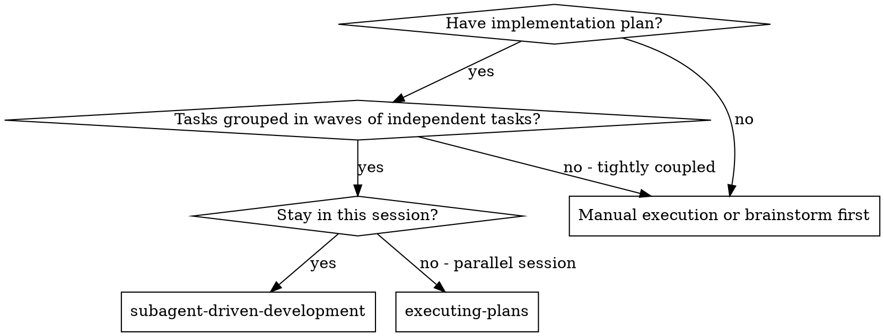
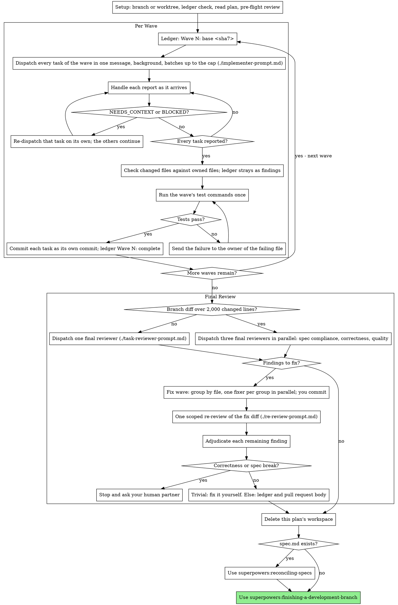

# Subagent-Driven Development

Execute plan wave by wave: dispatch every task of a wave to its own fresh implementer subagent in one message, check that each task changed only its owned files, run the wave's test commands once, and commit each task. After the last wave, one whole-branch review, one fix wave and one scoped re-review.

**Why subagents:** You delegate tasks to specialized agents with isolated context. By precisely crafting their instructions and context, you ensure they stay focused and succeed at their task. They should never inherit your session's context or history — you construct exactly what they need. This also preserves your own context for coordination work.

**Core principle:** Fresh subagent per task + every task of a wave in parallel + the wave's test commands once per wave + one final review of the whole branch + one fix wave and one scoped re-review = high quality, fast iteration

**Narration:** between tool calls, narrate at most one short line — the
ledger and the tool results carry the record.

**Continuous execution:** Do not pause to check in with your human partner between tasks or between waves. Execute all waves from the plan without stopping. The only reasons to stop are the five named below, or all waves complete. "Should I continue?" prompts and progress summaries waste their time — they asked you to execute the plan, so execute it.

**Rulings, not stalls.** A running plan does not wait on a human. Conflicts,
ambiguities, plan defects, a cap you would have asked to exceed — decide
them. The spec is the binding authority, the plan is its argument, and your
judgment settles what neither answers.

**This authority is yours alone.** You coordinate, so you see the whole plan,
the spec and every task. An implementer sees one brief. It rules on nothing,
edits no plan and no spec, and implements no approach its brief did not state —
when its brief is wrong it reports BLOCKED and stops, and you fix the plan
here. An implementer that quietly repairs a plan to fit its own task leaves
every other task building against text that no longer describes the work.

Record every decision in the ledger as
`Ruling: <what you decided> — <why> — <what it costs if wrong>`, and keep
going. A wrong ruling costs rework your human partner can see and undo; a
session parked on a question costs their whole day and buys nothing.

Five things stop you, and only these: an irreversible or destructive
operation; a security-sensitive action; a side effect outside this worktree
that norms say you ask about first (a merge, a push to a shared branch, a
publish); a plan so broken that every path forward is a guess; and a
correctness or spec break that remains after the fix wave (see Final
Review). For those, stop and ask.

## When to Use



**vs. Executing Plans (parallel session):**
- Same session (no context switch)
- Fresh subagent per task (no context pollution)
- Every task of a wave runs in parallel; the wave's test commands run once per wave; one review of the whole branch at the end
- Faster iteration (no human-in-loop between tasks or waves)

## The Process



## Setup

Work on the current feature branch, or in the worktree the session already
uses; superpowers:using-git-worktrees can create one or verify the existing
one. Never start implementation on a main/master branch without your human
partner's explicit consent.

**One branch, one committer.** After the first dispatch, nothing creates,
switches or checks out a branch — not you, not a subagent. Parallel
implementers share one working tree, so a branch switch under them moves
every task's files at once. Only you commit. A subagent runs no git state
command: no `add`, `commit`, `stash`, `checkout` or `switch`.

Conversation memory does not survive compaction. In real sessions,
controllers that lost their place have re-dispatched entire completed task
sequences — the single most expensive failure observed. Track progress in
a ledger file, not only in todos.

- Each plan owns a workspace: at skill start, run this skill's
  `scripts/sdd-workspace PLAN_FILE` — it prints the plan's git-ignored
  directory (`<repo-root>/.superpowers/sdd/<plan-basename>/`), home to
  every artifact for THIS plan: ledger, briefs, reports, review packages.
  Another plan's directory is never yours to read or write.
- Check for this plan's ledger at `<workspace>/progress.md`. If its first
  line names your plan file, a wave with a `Wave <N>: complete` line is
  DONE — do not re-dispatch it; resume at the first wave without one. In
  that wave, a task with a `Task <N>: complete` line, or whose owned files
  are already committed since the `Wave <N>: base <sha7>` line (check
  `git log`), is DONE. Re-dispatch only the tasks whose files are not
  committed, and tell each one that its owned files may hold partial work
  from an earlier attempt. When every wave is complete, resume at the
  final review — or, when the ledger has a `Fix wave:` line, at the scoped
  re-review. A ledger whose first
  line names a different plan file — or a stray ledger at the old flat
  path `.superpowers/sdd/progress.md` — is another plan's progress: leave
  it in place and start your own, fresh.
- Create the ledger with its identity as the first line:
  `# SDD ledger — plan: <plan file path>`.
- The ledger is your recovery map: the commits it names exist in git even
  when your context no longer remembers creating them. After compaction,
  trust the ledger and `git log` over your own recollection.
- `git clean -fdx` will destroy the workspace (it's git-ignored scratch); if
  that happens, recover from `git log`.

Read the plan once, note its context, its Global Constraints and its Waves
table, and create a todo per task and one per wave. If the plan names a Spec, read that too: the spec is the
authority the plan argues from, and conflicts inside the plan resolve
against it. A plan with no reachable spec gets a ledger note saying so —
rulings made without one are provisional.

Before dispatching Wave 1, scan the plan once for conflicts, writing down
what you checked as you check it:

- tasks that contradict each other or the plan's Global Constraints
- two tasks in one wave that list the same file under **Files** — they
  cannot run in parallel, so rule on which wave each belongs in
- anything the plan explicitly mandates that the review rubric treats as a
  defect (a test that asserts nothing, verbatim duplication of a logic block)

The scan's output is a table, not a verdict. One row for every pair of tasks
that share a file or an interface: the two tasks, what one produces against
what the other consumes, and what you found. One row for every task: whether
its own text agrees with itself — the tests it specifies against the code it
specifies, the files it creates against the files it later touches. "The scan
is clean" without those rows is not a scan you ran.

Write the table to the ledger. Rule on everything you find before execution
begins — each finding against the plan text that mandates it — and record
each ruling in the ledger. If the scan is clean, proceed without comment.
Rule on each conflict it surfaces — the spec is the binding authority, the
plan is its argument — record the ruling beside its row, and dispatch
Wave 1. The final review remains the net for conflicts that only emerge from
implementation.

## Model Selection

**The plan decides. Read the model from the task.** A plan written by
`superpowers:writing-plans` names a model for every task a subagent
implements. Use it. When you dispatch on a different model than the plan named,
say so out loud and give the reason — a silent substitution makes the plan a
lie and hides a cost from your human partner.

The rest of this section settles a case the plan did not name, and defines the
tiers the plan refers to.

Use the least powerful model that can handle each role to conserve cost and increase speed.

**Mechanical implementation tasks** (isolated functions, clear specs, 1-2 files): use a fast, cheap model. Most implementation tasks are mechanical when the plan is well-specified.

**Integration and judgment tasks** (multi-file coordination, pattern matching, debugging): use a standard model.

**Architecture and design tasks**: use the most capable available model.
The final whole-branch review is one of these — dispatch it on the most
capable available model, not the session default.

**Review tasks**: choose the model with the same judgment, scaled to the
diff's size, complexity, and risk. A small mechanical diff does not need the
most capable model; a subtle concurrency change does. Scoped re-reviews of
small fix diffs take a cheap-to-mid tier.

**Fix-wave escalation (fresh fixer)**: when the original implementer is not
reachable, use a model at least one tier above that implementer.

**Always specify the model explicitly when dispatching a subagent.** An
omitted model inherits your session's model — often the most capable and
most expensive — which silently defeats this section.

**Turn count beats token price.** Wall-clock and context cost scale with how
many turns a subagent takes, and the cheapest models routinely take 2-3× the
turns on multi-step work — costing more overall. Use a mid-tier model as the
floor for reviewers and for implementers working from prose descriptions.
When the task's plan text contains the complete code to write, the
implementation is transcription plus testing: use the cheapest tier for
that implementer. Single-file mechanical fixes also take the cheapest tier.

**Task complexity signals (implementation tasks):**
- Touches 1-2 files with a complete spec → cheap model
- Touches multiple files with integration concerns → standard model
- Requires design judgment or broad codebase understanding → most capable model

## Area Context

Repositories keep conventions next to the code they govern. An implementer that
does not read them reimplements a helper that already exists, or breaks a
convention nobody wrote down twice.

**What a subagent gets on its own.** Measured, not assumed — a dispatched
implementer that reads a file two directories deep receives:

| Source | Arrives? |
|---|---|
| `~/.claude/CLAUDE.md` and the project root `CLAUDE.md` | yes, at dispatch |
| A nested `CLAUDE.md` in any directory on the path to a file it reads | yes, on the read |
| `.claude/rules/*.md` whose `paths:` glob matches | yes, on the read |
| **`AGENTS.md`, at any depth** | **no, never** |
| Your conversation, the files you read, `SessionStart` output | no |

So the `CLAUDE.md` hierarchy looks after itself, including nested files and
path-scoped rules. Do not paste any of it into a dispatch.

**`AGENTS.md` is the gap.** Claude Code does not read it, at the root or in a
subdirectory. A repository that keeps conventions in `AGENTS.md` hands its
implementers nothing. Before dispatching, walk from the repo root down to each
file the task edits and name the path of every `AGENTS.md` that has no
`CLAUDE.md` beside it:

```bash
# AGENTS.md files governing a task that edits app/campaigns/models.py
d=app/campaigns; while [ "$d" != "." ]; do
  [ -f "$d/AGENTS.md" ] && [ ! -f "$d/CLAUDE.md" ] && echo "$d/AGENTS.md"
  d=$(dirname "$d")
done
```

Name the paths, never the contents. A 300-line area guide pasted into a dispatch
stays in your context for the rest of the session, and the subagent can read a
path for itself.

**The repository can fix this once** instead of every dispatch paying for it:
symlink each subdirectory `AGENTS.md` to a `.claude/rules/*.md` that carries the
matching `paths:` frontmatter. The rule then loads by itself, and other tools
still find the file where they expect it. Say so once when you notice a repo
with unaccompanied `AGENTS.md` files. Do not restructure their repository
mid-task.

**A subagent's `CLAUDE.md` can be stale.** An implementer dispatched after you
edited `CLAUDE.md` was observed receiving the version from before the edit. When
a task depends on an instruction file this session changed, put the changed rule
in the brief rather than trusting the hierarchy to carry it.

**When a repository has none of these,** say so in the ledger once and move on.
Their absence is a fact about the repository, not a reason to stop.

## The Wave Loop

Run the waves in the order of the plan's Waves table. A wave is a group of
tasks that share no owned file — the files a task lists under **Files** —
and that depend only on earlier waves, so every task of a wave runs at the
same time in one working tree. A plan with no Waves table runs each task as
its own wave, in plan order.

**Batch small same-shape work.** When the plan lists several tasks that are
each a small, independent edit of the same kind — the same one-line fix,
constant change, or field addition repeated across files — do not dispatch
one subagent per task. Compose ONE dispatch brief listing every file and
its change, send the whole batch to a single subagent, and commit its diff
as one unit. Reserve one-dispatch-per-task for work that needs its own
judgment or its own tests.

Everything you paste into a dispatch prompt — and everything a subagent
prints back — stays resident in your context for the rest of the session
and is re-read on every later turn. Hand artifacts over as files.

**Waiting on dispatched subagents:** never poll a wait interface with
short timeouts, and never sit in one silent, open-ended wait either.
While you have local work — ledger updates, reading reports, re-dispatching
a blocked task — keep working; child results arrive on their own.
When you are genuinely idle, wait in bounded stretches (five to ten
minutes, where your platform allows), and between stretches post one
line of status and reconcile your live children: list them, and chase
any that finished without reporting. A bounded stretch keeps nearly
all of a long wait's efficiency while guaranteeing a stuck or lost
child is noticed within minutes, not at the end of the session.

### 1. Dispatch the wave

Before the wave's first dispatch, record the wave BASE (`git rev-parse HEAD`)
and append `Wave <N>: base <sha7>` to the ledger. A session that resumes
after compaction reads it from that ledger line.

Dispatch every task of the wave in one message, as background subagents.
When the wave holds more tasks than your harness's concurrency cap, dispatch
it in batches up to the cap, and send the next batch as soon as a slot
frees.

- **Task brief:** before dispatching an implementer, run this skill's
  `scripts/task-brief PLAN_FILE <N>` with the plain task ID (for example
  `scripts/task-brief PLAN_FILE 3`) — it extracts the task's full text to a
  uniquely named file and prints the path. Compose the dispatch so the
  brief stays the single source of
  requirements. Your dispatch should contain: (1) one line on where this
  task fits in the project; (2) the brief path, introduced as "read this
  first — it is your requirements, with the exact values to use verbatim";
  (3) interfaces and decisions from earlier tasks that the brief cannot
  know; (4) your resolution of any ambiguity you noticed in the brief;
  (5) the paths of the area instruction files covering the directories this
  task touches (see Area Context above); (6) the report-file path and report
  contract. Exact values (numbers, magic strings, signatures, test cases)
  appear only in the brief. Never make a subagent read the whole plan file.
- **Owned files and no git state commands:** the dispatch carries the
  owned-files contract (it is in the implementer template): the implementer
  edits only its owned files and runs no git state command. Other tasks of
  the wave are editing the same working tree at the same moment.
- **Area context:** a subagent gets the `CLAUDE.md` hierarchy — user,
  project root, local, managed — automatically at dispatch. It does **not**
  get your conversation, the files you have read, or anything a `SessionStart`
  hook injected, because a dispatch fires `SubagentStart` instead. Whether
  a *nested* `CLAUDE.md` or a `paths:`-scoped rule loads inside the
  subagent's own file reads is not something to rely on. So name the area
  files. See Area Context above for how to find them.
- **Report file:** name the implementer's report file after the brief
  (brief `…/task-<N>-brief.md` → report `…/task-<N>-report.md`) and put it in
  the dispatch prompt. The implementer writes the full report there and
  returns only status, the files it changed, a one-line test summary, and
  concerns.
- A dispatch prompt describes one task, not the session's history. Do not
  paste accumulated prior-task summaries ("state after Tasks 1-3") into
  later dispatches — a real session's dispatch hit 42k chars of which 99%
  was pasted history. A fresh subagent needs its task, the interfaces it
  touches, and the global constraints. Nothing else.
- The dispatch carries the no-subagents contract (it is in the
  implementer template): the implementer never dispatches subagents —
  not helpers, and never a reviewer. Review arrives from you, after the
  last wave. In real sessions, every reviewer a worker spawned duplicated
  the task review the controller dispatched anyway — a full extra
  review seat per task.
- Record each implementer's agent identity from the dispatch result — a
  test failure goes back to it, and the fix wave resumes it.

Template: [implementer-prompt.md](implementer-prompt.md)

### 2. Handle each report as it arrives

Implementer subagents report one of four statuses. Handle each report as it arrives, while the rest of the wave keeps running:

**DONE:** Read the files the implementer says it changed and compare them with its owned files. Nothing is tested or committed yet — that happens once, when every task of the wave has reported. No reviewer runs per task or per wave; the final review covers the whole branch.

**DONE_WITH_CONCERNS:** The implementer completed the work but flagged doubts. Read the concerns before proceeding. If the concerns are about correctness or scope, address them, then handle it as DONE. If they're observations (e.g., "this file is getting large"), note them in the ledger for the final reviewer, then handle it as DONE.

**NEEDS_CONTEXT:** The implementer needs information that wasn't provided. Provide the missing context and re-dispatch that task on its own. The other tasks of the wave continue.

**BLOCKED:** The implementer cannot complete the task. Assess the blocker, then re-dispatch that task on its own while the other tasks of the wave continue:
1. If it's a context problem, provide more context and re-dispatch with the same model
2. If the task requires more reasoning, re-dispatch with a more capable model
3. If the task is too large, break it into smaller pieces
4. If the plan itself is wrong, rule on the correction, ledger it, and re-dispatch with the ruling carried in the dispatch

A re-dispatch keeps the task's owned files. Never hand a blocked task a file that another task of the wave owns.

**Never** ignore an escalation or force the same model to retry without changes. If the implementer said it's stuck, something needs to change.

If the implementer asks questions — before starting or mid-task — answer
clearly and completely, provide additional context if needed, and don't
rush it into implementation.

### 3. Close the wave

When every task of the wave has reported DONE or DONE_WITH_CONCERNS:

1. **Check the owned files.** Run `git status --porcelain`. Each changed file
   must belong to the owned files of one task of this wave. A changed file
   outside every task's owned files is a finding for the final review:
   ledger `Wave <N>: finding — <path> changed outside every task's owned
   files`, leave it out of every task commit, and commit it on its own so
   the final reviewer sees it in the branch diff.
2. **Run the wave's test commands once** — the test and check commands the
   wave's tasks name — and read only the result: pass or fail. On fail, send
   the failure to the implementer that owns the failing file (the agent
   identity you recorded at dispatch) with the test output, wait for its
   fix, and run the commands again. If the same command fails again after
   the resend, handle that task as BLOCKED.
3. **Commit each task as its own commit.** Stage only that task's owned
   files and commit with a message that names the task. Append
   `Task <N>: complete (commits <base7>..<head7>, tests pass)` for each
   task and mark its todo complete.
4. **Complete the wave.** Append `Wave <N>: complete (<base7>..<head7>)`,
   from the wave BASE to HEAD, in the same message as your other
   bookkeeping, mark the wave's todo complete, and dispatch the next wave.

Never dispatch the next wave while a task of this wave is uncommitted or
its tests fail.

## Final Review

After the last wave, review the branch once. No reviewer runs per task or
per wave; this is the only review.

The final review reads the whole branch diff from the branch base, the spec
and the plan. Hand it the diff as a file: run
`scripts/review-package PLAN_FILE MERGE_BASE HEAD` (MERGE_BASE = the commit the
branch started from, e.g. `git merge-base main HEAD`) and pass the reviewer
the path it prints (or, without bash: `git log --oneline`,
`git diff --stat`, and `git diff -U10` for the range, redirected to one
uniquely named file). The output never enters your own context, and the
reviewer sees the commit list, stat summary, and full diff with context in
one Read call. Never dispatch a final reviewer without a diff file. Dispatch
on the most capable available model (see Model Selection), using
[task-reviewer-prompt.md](task-reviewer-prompt.md).

**One reviewer, or three.** Dispatch one final reviewer by default. When the
branch diff has more than 2,000 changed lines (insertions plus deletions in
`git diff --shortstat MERGE_BASE HEAD`), dispatch three final reviewers in
parallel, in one message, each named one category: spec compliance,
correctness, or quality.

- **Reviewer inputs:** the review package, the spec path, the plan path,
  the ledger's findings (files changed outside every task, deferred
  minors, concerns noted for the final reviewer, rulings), and the global
  constraints that bind the branch.
- The global-constraints block you hand the reviewer is its attention
  lens. Copy the binding requirements verbatim from the plan's Global
  Constraints section or the spec: exact values, exact formats, and the
  stated relationships between components ("same layout as X", "matches
  Y"). The reviewer's template already carries the process rules (YAGNI,
  test hygiene, review method) — the constraints block is for what THIS
  project's spec demands.
- Do not add open-ended directives like "check all uses" or "run race tests
  if useful" without a concrete, task-specific reason
- Do not ask a reviewer to re-run tests the implementers already ran on the
  same code — the implementer reports carry the test evidence
- Do not pre-judge findings for the reviewer — never instruct a reviewer to
  ignore or not flag a specific issue. If you believe a finding would be a
  false positive, let the reviewer raise it and adjudicate it after the
  re-review. If the prompt you are writing contains "do not flag," "don't treat X
  as a defect," "at most Minor," or "the plan chose" — stop: you are
  pre-judging, usually to spare yourself a review loop.

**Keep the tree clean around every review.** A final reviewer may make
up to 3 mutations to test a risk, and reverts each one. Before you dispatch any
reviewer, record `git status --porcelain`. When the review returns, run it again.
If a path changed, restore only that path (`git restore -- <path>` for a tracked
file; delete a file the review created), ledger
`Final review: tree restored after review (<paths>)`, and only then dispatch the
next agent. A reviewer never runs while an implementer does.

The final reviewer may report "⚠️ Cannot verify from diff" items — requirements
that live in unchanged code or span tasks. These do not block the rest of the
review, but you must resolve each one yourself before the fix wave: you hold
the plan and cross-task context the reviewer
lacks. If you confirm an item is a real gap, treat it as a failed spec
review — it enters the fix wave with the other findings.

Template: [task-reviewer-prompt.md](task-reviewer-prompt.md)

### The fix wave

The fix wave triggers when the final review reports spec ❌, any Critical or
Important finding, or a ⚠️ item you confirmed as a real gap.

Before the fix wave, two routes leave it immediately:

- Record Minor findings in the progress ledger
  (`Final review: minor (deferred): <one-liner>`) and in the pull request
  body. A roll-up nobody reads is a silent discard. Minor findings never
  enter the fix wave.
- A finding labeled plan-mandated — or any finding that conflicts with
  what the plan's text requires — is yours to rule on: weigh the finding
  against the plan text, decide with the spec as the binding authority, and
  ledger the ruling before you act on it. Do not dismiss the finding because
  the plan mandates it, and do not dispatch a fix that contradicts the plan
  without a recorded ruling.

Everything else enters the fix wave, and there is exactly one:

**Group the findings by file.** One group per file; a finding that spans
files merges their groups, so no file sits in two groups. Dispatch one fixer
per group, all in one message, in parallel. A fixer's owned files are the
files of its group, and it works under the same owned-files and
no-git-state-command rules as an implementer.

**Resume the original implementer** of the task that owns the group's files
when that agent is reachable. Send it the group's findings verbatim. Its
context is intact: it knows the task, the code, and its own choices. When a
group spans tasks, resume the implementer of the latest task it touches, and
carry the other task's report path in the dispatch so it can read what that
task did.

**Else dispatch a fresh fixer one tier above** the original implementer's
model (per Model Selection), with every brief path and report-file path the
group's findings touch, the findings, and this framing: "A prior implementer
built this; you own the fix now. Read the report file for what was done."
The report file is the persistent memory either way.

**Every fixer:** fixes, re-runs the tests covering the amended code, appends
its fix report to the same report file, and returns the short contract.
Name the covering test files in the fix message — a one-line fix does not
need the whole suite.

When every fixer has reported, check the owned files and run the covering
tests as you close a wave, then commit each group as its own commit. Append
`Fix wave: complete (<base7>..<head7>, <G> groups)` to the ledger.

**The scoped re-review.** Before dispatching it, confirm each fix report
contains the covering tests, the command run, and the output. Run
`scripts/review-package PLAN_FILE FIX_BASE HEAD` where FIX_BASE is the head
the final review saw, and dispatch [re-review-prompt.md](re-review-prompt.md)
with the findings list, the brief(s), the report file(s), and the printed
diff path. It reads the fix diff only. The re-reviewer verdicts each finding
ADDRESSED or NOT ADDRESSED and flags new breakage in the fix diff only. New
Critical/Important breakage in the fix diff joins the remaining findings.
Out-of-scope observations go to the ledger as deferred minors — they never
extend the fix wave.

Before the re-review, never fix findings yourself in the controller
session — your context stays clean for coordination, and controller fixes
skip review.

**No second fix wave.** The cap is the end of the one fix wave: the
re-review has returned. Adjudicate each finding that remains — you hold the
plan and the cross-task context the reviewer lacks:

- **The reviewer is wrong, or the point is contestable:** ledger
  `Remaining: <finding> — Ruling: <why the code stands>`, and carry it into
  the pull request body. The reader sees both sides.
- **Trivial:** fix it yourself, run the covering tests, and commit. A
  trivial finding is one whose fix changes only documentation files,
  comments, or docstrings — never code, never skill instruction text (a
  skill's SKILL.md is instruction text, not documentation), and never a
  test body. Ledger `Remaining: <finding> — Ruling: fixed by the controller
  (<sha7>)`.
- **A correctness or spec break:** stop and ask your human partner. Name
  the finding, what the fix wave tried, and the smallest change you would
  make.
- **Anything else:** ledger `Remaining: <finding> — Ruling: <why it can
  wait>` and put it in the pull request body.

Adjudicate only at the cap. Adjudicating earlier to end a loop is
pre-judging with a different name. Every adjudication is a ledger entry —
a silent discard is forbidden.

## Finish

Before you delete anything, collect every ledger line containing `Ruling:` —
preflight rulings, remaining findings, fix-wave adjudications, all of them — into
your final message under "Rulings I made", in the order you made them, each
with what it costs if wrong. The list is exhaustive: if the ledger holds a
ruling, the list holds it. That list is the only place the decisions you
took on your human partner's behalf reach them — they read it and rework
whatever you got wrong. A ruling that dies with the workspace was a decision
made in secret. List the remaining findings and deferred minors under
"For the pull request body", so the pull request carries them.

When the re-review has returned and every remaining finding has its ruling,
delete this plan's workspace (`rm -rf <workspace>`) — the git history is
the record now. Sibling directories belong to other plans; leave them
alone.

**Then reconcile the spec, if there is one.** Check for `spec.md` in the
change record directory — check the file, do not go from memory.

- **`spec.md` exists:** use superpowers:reconciling-specs. It lists what the
  build changed, gets a ruling on each divergence, updates the spec, and hands
  over to the finish skill itself.
- **No `spec.md`** (a bounded change went intent → plan): use
  superpowers:finishing-a-development-branch directly.

Every wave loop departs from the spec somewhere — that is what the rulings
above are. Shipping without reconciling leaves the spec describing software
nobody built, and the next change inherits it.

## Common Rationalizations

| Excuse | Reality |
|--------|---------|
| "Close enough on spec compliance" | Reviewer found spec gaps = not done. Fix or hit the cap and adjudicate — those are the only exits. |
| "I'll fix it myself, dispatching is overhead" | Controller fixes pollute your context and skip review. Resume the implementer. This holds for findings before the re-review. |
| "One more round will converge" | Past the cap, rounds don't converge — the failure is structural. Adjudicate and route. |
| "The reviewer will just find something new anyway" | Scoped re-reviews verify fixes; they cannot wander. New findings on untouched code go to the ledger, not the loop. |
| "This finding is obviously wrong, I'll drop it" | You adjudicate only at the cap, and every ruling is a ledger entry. Silent discards are forbidden. |
| "The fix touched code, but it was small" | Any change to code or test bodies gets a scoped re-review. |
| "Reviews slow the loop down" | The loop without reviews is just unverified churn. Reviews are the loop's brakes and steering. |
| "Ledger bookkeeping is overhead" | The ledger is what survives compaction. Controllers without one have re-dispatched entire completed task sequences. |
| "The implementer spawned its own reviewer — free extra assurance" | It's a duplicate seat reviewing the same diff; the task review is the gate. A worker-spawned reviewer is a defect to flag, not rigor. |

## Example Workflow

```
You: I'm using Subagent-Driven Development to execute this plan.

[Setup: on the feature branch, worktree verified]
[Read plan file once: docs/superpowers/plans/feature-plan.md — Waves: 1 = Tasks 1, 2; 2 = Task 3]
[Resolve workspace: scripts/sdd-workspace docs/superpowers/plans/feature-plan.md — no ledger inside, fresh start]
[Create todos for all tasks and waves]
[Ledger: Wave 1: base a1b2c3d]

Wave 1: Tasks 1 and 2

[Run task-brief PLAN_FILE 1 and task-brief PLAN_FILE 2]
[One message: dispatch both implementers in the background, each with brief + report paths + context]

Task 2 implementer: "Before I begin - should the hook be installed at user or system level?"

You: "User level (~/.config/superpowers/hooks/)"

Task 1 implementer: DONE
  - Added verify/repair modes in src/recovery.js
  - 8/8 tests passing

Task 2 implementer: DONE
  - Implemented install-hook command in src/install-hook.js
  - Added tests, 5/5 passing

[git status: src/recovery.js, test/recovery.test.js, src/install-hook.js, test/install-hook.test.js — each in one task's owned files]
[Run the wave's test commands once — 13/13 passing]
[Commit Task 1, then Task 2]
[Ledger: Task 1: complete (commits a1b2c3d..d4e5f6a, tests pass)]
[Ledger: Task 2: complete (commits d4e5f6a..b7c8d9e, tests pass)]
[Ledger: Wave 1: complete (a1b2c3d..b7c8d9e)]

Wave 2: Task 3

...

[After the last wave]
[Run review-package PLAN_FILE MERGE_BASE HEAD — 640 changed lines, so one reviewer]
[Dispatch the final reviewer, most capable model, with the package, spec and plan]
Final reviewer: Spec ❌:
  - Missing: Progress reporting (spec says "report every 100 items")
  Issues (Important): Magic number (100) in src/recovery.js

[Fix wave: one group (src/recovery.js); Task 1's implementer is reachable — resume it with both findings]
Implementer: Added progress reporting, extracted PROGRESS_INTERVAL constant.
  Re-ran test/recovery.test.js — 10/10 passing. Fix report appended.

[Commit the group; Ledger: Fix wave: complete (e3f4a5b..c0d1e2f, 1 groups)]
[Run review-package PLAN_FILE FIX_BASE HEAD; dispatch scoped re-review]
Re-reviewer: Missing progress reporting — ADDRESSED (src/recovery.js:41).
  Magic number — ADDRESSED (src/recovery.js:7). New breakage: none.
  Verdict: all findings addressed.

[No remaining findings. Delete this plan's workspace — the record now lives in git]

Done! Using superpowers:finishing-a-development-branch.
```
